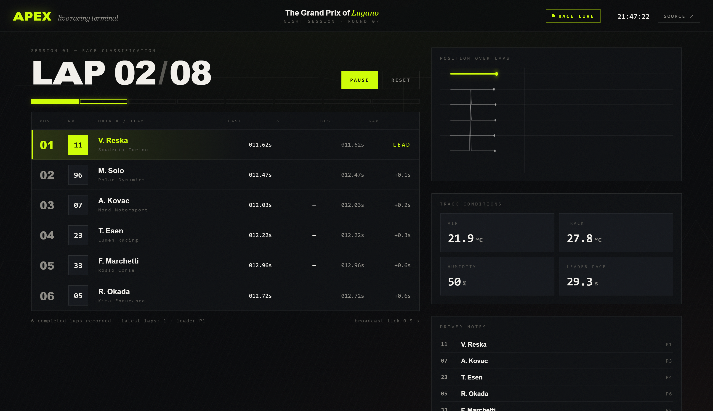
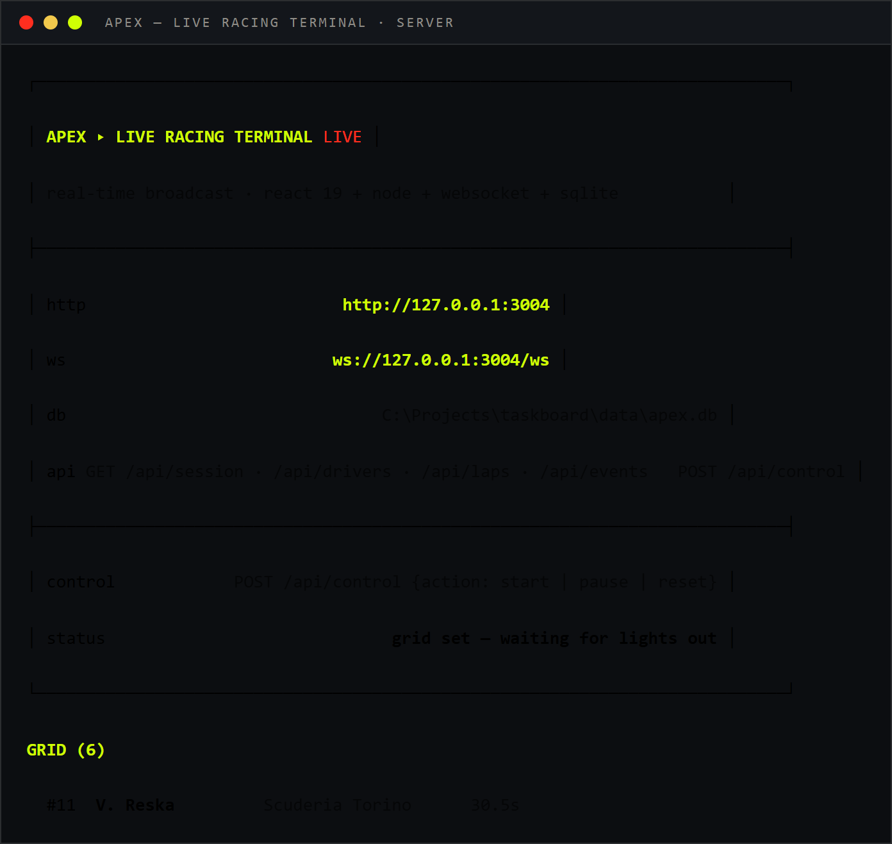

# REDLINE — Live Racing Terminal

Real-time race broadcasting platform: a live timing screen for motorsport
with position battles, fastest laps, pit windows and a rolling event ticker —
pushed to every connected client over WebSocket.

[](https://github.com/AlexBlack-Dev/redline/actions/workflows/ci.yml)
[](LICENSE)

## Stack

| Layer      | Tech                                   |
| ---------- | -------------------------------------- |
| Backend    | Node.js (http core), TypeScript        |
| Storage    | SQLite via better-sqlite3 (WAL)        |
| Real-time  | WebSocket (ws), race tick broadcast    |
| Frontend   | React 19, Vite 8, self-hosted fonts    |
| Tests      | Vitest (unit + simulator + REST + WS)  |

## Quick start

```bash
npm install
npm run dev            # server on :3004 (idle, grid set)
npm run dev:client     # Vite dev server on :5173
```

Open `http://localhost:5173`. To start the race from HTTP:

```bash
curl -X POST http://127.0.0.1:3004/api/control -d "{\"action\":\"start\"}" -H "Content-Type: application/json"
```

`npm run build` compiles the client into `client/dist`, which the server then
serves itself — the whole terminal lives on `http://127.0.0.1:3004`.

## Terminal

| Race screen (live timing) | Server boot |
| ------------------------- | ----------- |
|  |  |

## API

| Method | Route            | Action                      |
| ------ | ---------------- | --------------------------- |
| GET    | `/api/session`   | full race snapshot+ticker   |
| GET    | `/api/drivers`   | grid (6 drivers)            |
| GET    | `/api/laps`      | completed lap history       |
| GET    | `/api/events?after=` | race events (cursor)    |
| POST   | `/api/control`   | `{action: start\|pause\|resume\|reset}` |

While the race runs, every tick (500 ms by default) pushes
`{"type":"race","snapshot":{...}}` to all WebSocket clients: standings, lap
segments, gap to leader, last/best lap, pit state, track conditions, event
ticker. A single session phase — `idle` → `running` → `paused` → `finished` —
drives the whole terminal; `pause` freezes the virtual clock, `resume` picks
it up exactly where it stopped.

## Architecture

```
client/  React 19 SPA (Vite) — timing typography, live graph, ticker
src/
  db.ts        SQLite store: drivers, laps, events (WAL, single-writer)
  sim.ts       RaceRunner: virtual clock, pace model, honest pit windows, gaps
  server.ts    http core + ws push + static client
  main.ts      boot banner, control flags (--start)
test/    Vitest: store, simulator, REST, WebSocket protocol
```

Design decisions:

- **Model over state** — the simulator runs on a single virtual clock: every
  tick advances each driver by `dt`, laps complete when accumulated time beats
  the pace, and positions derive from laps + partial progress, never from
  ad-hoc flags. Pit stops cost real time (they add to the total, they don't
  erase it), so a driver who pits drops down the order and fights back on
  tyres. Broadcast payloads are snapshots, so a reconnecting client converges
  immediately.
- **SQLite as the race recorder** — laps and events persist (WAL); the UI is a
  pure projection of the store, which makes replay/audit trivial.
- **Plain-Node http core** — no framework dependency; routing is explicit and
  covered by tests.
- **Self-hosted type** — Orbitron (racing tech face, variable 400–900,
  SIL OFL) ships as a single `woff2` in the client; the terminal renders
  identically offline, font and license files included in the repository.
- **Real F1 car markers** — position history uses an actual Formula 1 car
  glyph (SVG Repo, CC0) tinted via `currentColor`: paper cars for the field,
  glowing lime for the leader.

## Tests

```bash
npm run typecheck   # tsc --noEmit
npm test            # vitest run — 23 tests
```

CI runs typecheck → tests → production build on Node 22.

## Typography & palette

Display & data: Orbitron (racing tech face, variable weight, tabular
numerals, tight tracking) · Accent: racing lime `#CFFF04` on ink `#07080A`,
paper `#F3F1EC`, alert red `#FF2E1F`, purple for best laps. Screen texture:
dot grid, hairline rules, oversized lap numeral. Position graph draws smooth
interpolated position lines (lime for the leader) without car glyphs.
Background: after lights out, a dimmed playlist of four race footage clips
(Pixabay license, shipped in `client/public`) cross-fades on every loop; the
screen stays clean while the race is idle. No rounded corners, no
icon-swirl — broadcast-board language. Icons: Lucide (ISC) inlined as React
components.